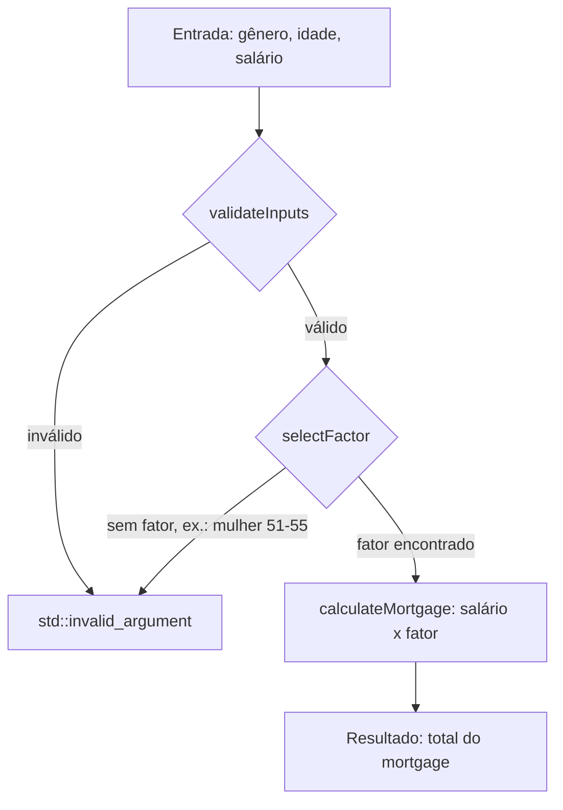

# Arquitetura do Mortgage

```mermaid
flowchart TD
    A[Entrada: gênero, idade, salário] --> B{validateInputs}
    B -- inválido --> E[std::invalid_argument]
    B -- válido --> C{selectFactor}
    C -- sem fator, ex.: mulher 51-55 --> E
    C -- fator encontrado --> D[calculateMortgage: salário x fator]
    D --> R[Resultado: total do mortgage]
```
